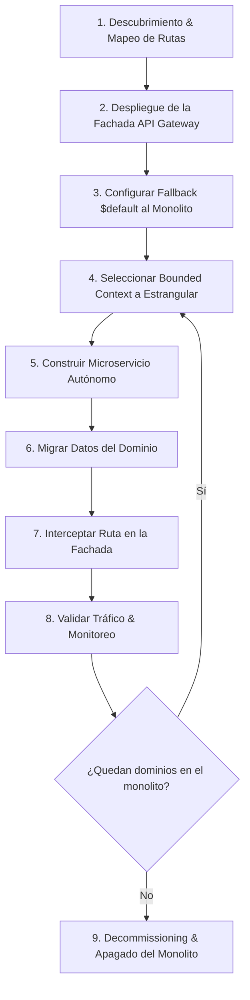

# 🌿 Steering: Patrón Strangler Fig para Migración de Monolitos

Este documento define la directriz y el procedimiento operativo estándar para ejecutar una migración de un sistema monolítico existente hacia una arquitectura distribuida o serverless sin tiempo de inactividad (**Zero Downtime**).

---

## 📌 1. Principios Rectores del Strangler Fig

1. **Prohibido el "Big Bang"**: Nunca reescribas un sistema completo desde cero para hacer un despliegue masivo único. La migración debe ser incremental, dominio por dominio.
2. **Paridad Funcional Estricta**: Cada endpoint migrado debe respetar los mismos contratos de entrada (query params, headers, payload JSON) y contratos de salida (códigos de estado HTTP, estructura del cuerpo de respuesta).
3. **Fachada de Enrutamiento Única (Strangler Facade)**: El cliente (Frontend / Mobile / APIs externas) debe interactuar con un único punto de entrada (API Gateway / Reverse Proxy). El cliente nunca debe saber si una petición es atendida por el monolito o por un nuevo microservicio.
4. **Fallback Transparente al Monolito**: Toda ruta que no haya sido expresamente migrada debe ser dirigida por defecto hacia el backend legado sin alteración.
5. **Autonomía por Dominio**: Cada dominio estrangulado debe nacer desacoplado, con su propia persistencia (*Database-per-service*) y su propio ciclo de CI/CD.

---

## 🔄 2. Fases de Ejecución Paso a Paso

### Fase 1: Descubrimiento & Mapeo del Monolito
1. Auditar todas las rutas HTTP expuestas por el monolito (`routes/api.php`, controllers, middleware de auth).
2. Agrupar los endpoints por **Bounded Contexts** (ej: Autenticación, Catálogo, Pagos, Operaciones, Notificaciones).
3. Identificar dependencias cruzadas entre tablas en la base de datos relacional del monolito (Foreign Keys, Joins).
4. Ordenar los dominios según su nivel de acoplamiento y riesgo:
   * **Candidato Ideal para Iniciar:** Dominios de configuración, catálogos estáticos o lectura pura (bajo riesgo, sin dependencias complejas).
   * **Dominios Intermedios:** Autenticación, usuarios, perfil de clientes.
   * **Dominios Finales:** Motores transaccionales y facturación principal.

---

### Fase 2: Despliegue de la Fachada (Strangler Facade)
1. Desplegar un **Amazon API Gateway (HTTP API v2)** o **CloudFront / Application Load Balancer**.
2. Configurar la regla de integración de fallback:
   * Ruta: `$default` (o `{proxy+}`).
   * Integración: `HTTP_PROXY` apuntando a la URL base del monolito legado (ej. `https://monolito.dominio.com/api/{proxy}`).
3. Configurar **CORS** centralizado para clientes web y móviles:
   * `Allow-Origins`: `*` o dominios autorizados.
   * `Allow-Methods`: `GET, POST, PUT, PATCH, DELETE, OPTIONS`.
   * `Allow-Headers`: `Authorization, Content-Type, X-Api-Key, etc.`
4. Cambiar la URL base (`apiUrl`) en el frontend hacia la URL del API Gateway.
   * *Prueba de fuego:* Todo el sistema debe seguir funcionando al 100% a través del proxy hacia el monolito.

---

### Fase 3: Construcción del Microservicio de Dominio
1. Implementar el nuevo microservicio en una carpeta autónoma utilizando **Arquitectura Hexagonal**:
   * `adapter/`: Controladores HTTP y Mappers.
   * `application/`: Casos de uso e interfaces de servicio.
   * `domain/`: Entidades y reglas de negocio puras.
   * `infraestructure/`: Adaptador de base de datos (ej. DynamoDB) y clientes externos.
   * `ioc/`: Inyección de dependencias con InversifyJS.
   * `index.ts`: Lambda handler.
2. Diseñar la persistencia dedicada del dominio (ej. Tabla DynamoDB con Single-Table o Multi-Table según convenga).
3. Empaquetar con `esbuild` produciendo bundles independientes CJS para Node 20/22.

---

### Fase 4: Estrategia de Migración y Sincronización de Datos
Seleccionar la estrategia según la naturaleza del dominio:
* **Para datos de configuración/catálogos:** Script de exportación/importación o seed inicial directo a DynamoDB.
* **Para usuarios y autenticación:** Mantener compatibilidad de hash de contraseñas (ej. `bcrypt`) y esquema de tokens JWT para permitir logins cruzados.
* **Para operaciones transaccionales en vivo:** Estrategia **Dual-Write** o **Event-Driven CDC** (Change Data Capture) si el monolito necesita coexistir temporalmente mientras se valida la estabilidad.

---

### Fase 5: Intercepción de Rutas en la Fachada
1. En la plantilla de Infraestructura como Código (`template.yaml` / Serverless):
   * Registrar las rutas específicas del dominio migrado en el API Gateway vinculadas a la nueva Lambda (ej: `GET /v1/admin/rates`, `POST /v1/admin/rates`).
2. El API Gateway prioriza las rutas explícitas sobre la ruta `$default`:
   * Tráfico del dominio migrado ➔ **Nueva Lambda Serverless**.
   * Tráfico restante ➔ **Monolito Legado**.

---

### Fase 6: Retiro Seguro (Decommissioning)
1. Monitorear CloudWatch Logs y métricas de error (4xx, 5xx) durante un periodo de observación.
2. Eliminar o deshabilitar las rutas correspondientes en el código del monolito.
3. Repetir el ciclo desde la Fase 4 para el siguiente dominio.
4. Cuando el 100% de las rutas apunten a microservicios, retirar la integración `$default` y apagar la infraestructura del monolito.

---

## 📋 Checklist de Validación Strangler Fig

- [ ] ¿El API Gateway intercepta las peticiones sin alterar los headers ni tokens de autorización?
- [ ] ¿El fallback `$default` responde idénticamente al monolito original?
- [ ] ¿Los códigos de estado HTTP coinciden (200, 201, 204, 400, 401, 403, 404, 422)?
- [ ] ¿El nuevo microservicio almacena en su propia base de datos sin depender de la BD del monolito?
- [ ] ¿Se cuenta con un plan de rollback inmediato (basta con eliminar la ruta del API Gateway para que caiga al fallback)?
