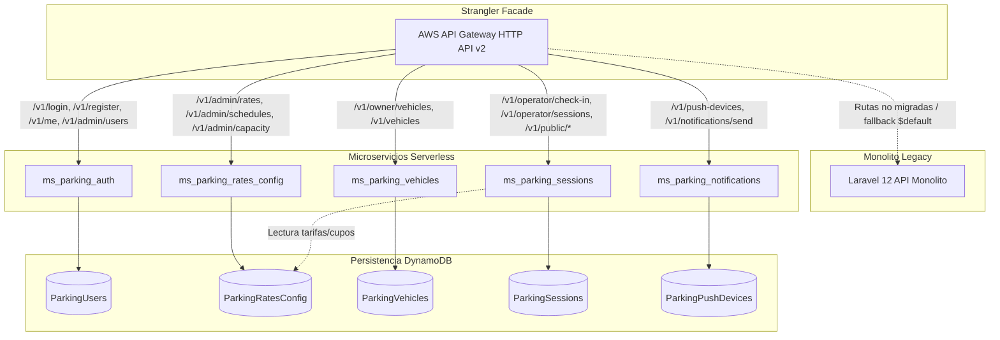
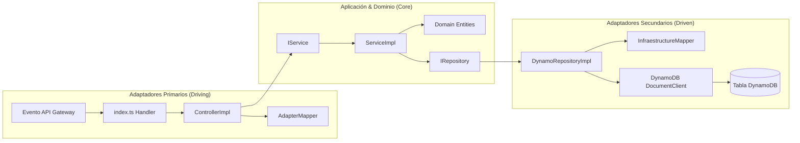

# 📘 Guía de Migración: Strangler Fig Pattern a Microservicios Serverless en AWS

Este documento detalla la estrategia de modernización aplicada para la migración del backend monolítico de **Parqueadero App** (Laravel 12 / PHP) hacia una **arquitectura de microservicios serverless en Node.js**, con **Arquitectura Hexagonal**, almacenamiento en **Amazon DynamoDB** y ejecución en **AWS Lambda**.

---

## 🎯 1. Objetivos de la Migración

1. **Desacoplar el monolito** en microservicios independientes orientados al dominio del negocio.
2. **Arquitectura Hexagonal (Ports & Adapters)** siguiendo la referencia de [`ms_rapiserv_products_lambda`](https://github.com/david-ortegac/ms_rapiserv_products_lambda).
3. **Escalabilidad Serverless** con pago por uso (Pay-as-you-go) mediante AWS Lambda y DynamoDB On-Demand.
4. **Cero tiempo de inactividad** utilizando el patrón **Strangler Fig (Higo Estrangulador)** para una transición gradual y segura.

---

## 🗺️ 2. Mapa de Dominios (Bounded Contexts)

---

## 🏗️ 3. Arquitectura Interna de Cada Microservicio

Cada microservicio sigue estrictamente el patrón de **Puertos y Adaptadores**:

---

## 🗓️ 4. Fases de Transición con el Patrón Strangler Fig

### Fase 1: Despliegue de la Fachada y Dominio Base (Tarifas y Capacidad)
* Despliegue del API Gateway HTTP API v2.
* Creación de la tabla `ParkingRatesConfig`.
* Migración de las rutas `/v1/admin/rates`, `/v1/admin/capacity`, `/v1/admin/schedules` y `/v1/admin/parking-info` a la Lambda `ms_parking_rates_config`.
* El resto de rutas continúan dirigiéndose al backend Laravel legacy.

### Fase 2: Dominio de Autenticación y Usuarios
* Creación de la tabla `ParkingUsers`.
* Carga de credenciales y migración de `/v1/login`, `/v1/register`, `/v1/me`, `/v1/admin/users` a `ms_parking_auth`.
* Los tokens JWT emitidos son compatibles con el estándar de la plataforma.

### Fase 3: Dominio de Vehículos
* Creación de la tabla `ParkingVehicles`.
* Conexión de `/v1/owner/vehicles` hacia `ms_parking_vehicles`.
* Validación automática de placas colombianas (carros: 6 caracteres, motos: 5 o 6 caracteres).

### Fase 4: Dominio de Operaciones y Facturación (Core de Negocio)
* Creación de la tabla `ParkingSessions`.
* Migración del flujo de check-in, check-out con el motor de cobro `ParkingBillingService`, reportes de ingresos y consulta pública por placa a `ms_parking_sessions`.

### Fase 5: Notificaciones Push (FCM)
* Creación de la tabla `ParkingPushDevices`.
* Registro de dispositivos en `ms_parking_notifications` y despacho automático de notificaciones ante eventos de ingreso/salida.

### Fase 6: Retiro y Desconexión del Monolito
* Una vez verificado el tráfico completo en los microservicios sin errores, se retira la regla de fallback del monolito y se apaga el servidor legacy.

---

## 🔐 5. Seguridad y Roles

El sistema utiliza **JSON Web Tokens (JWT)** con claims estructurados:
* `userId`: Identificador del usuario.
* `email`: Correo electrónico.
* `role`: Rol del usuario (`admin`, `operator`, `vehicle_owner`).
* `document`: Número de cédula o documento de identidad.

Los controladores validan a nivel de adaptador que el token sea válido y que el usuario posea el rol correspondiente (`hasRequiredRole`), devolviendo `401 Unauthorized` o `403 Forbidden` cuando aplique.

---

## ⚡ 6. Bundling con esbuild

Cada microservicio cuenta con un script de empaquetado ultra-optimizado [`build.config.mjs`](file:///home/david/Documentos/GitHub/parqueadero-app/microservices/ms_parking_rates_config/build.config.mjs):
* **Target:** `node22` / `node20`
* **Formato:** CommonJS (`format: "cjs"`)
* **Bundle:** Archivo único empaquetado en `dist/index.js`
* **External:** `@aws-sdk/client-dynamodb`, `@aws-sdk/lib-dynamodb` (nativos en el runtime de Lambda)
* **Tamaño promedio por Lambda:** ~250 KB a 290 KB, garantizando tiempos de Cold-Start inferiores a 100ms.
